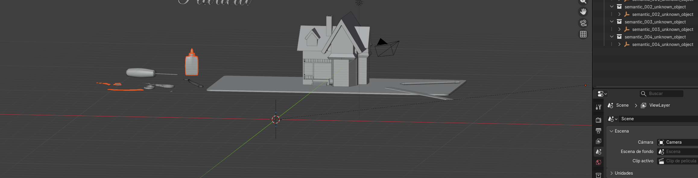

# Atlas Splitter

[](https://github.com/URANOOB/atlas-splitter/actions/workflows/ci.yml) [](pyproject.toml) [](https://docs.astral.sh/ruff/) [](LICENSE)

> Convierte atlas de texturas en piezas editables mediante segmentación 2D o coordenadas UV exactas de GLB/glTF. Todo el procesamiento es local.

CLI local y multiplataforma para convertir atlas de texturas en artefactos editables. Funciona en PowerShell, CMD, bash y terminales de macOS/Linux. Los archivos de entrada se procesan localmente.

## Inicio sencillo

Después de instalar, ejecuta simplemente:

```text
atlas-splitter
```

Consulta las guías de [inicio rápido](docs/quick-start.md), [instalación en Windows](docs/windows-installation.md), [GLB y UV](docs/glb-and-uv-workflow.md) y [solución de problemas](docs/troubleshooting.md).

El asistente ofrece atlas 2D, atlas+GLB/UV, `doctor` y modelos locales; valida rutas, permite volver al menú, muestra un resumen y devuelve el comando reproducible. El flujo básico no exige editar YAML.

## Dos modos

| Dispones de | Qué elige el asistente | Resultado |
| --- | --- | --- |
| Sólo atlas WEBP | Segmentación 2D | PNG, máscaras, PSD, manifiesto, contact sheet y ZIP. Ajusta `processing.padding` o `--calibration-pixels` para recuperar bordes. |
| GLB/glTF y atlas | Extracción guiada por UV | Máscaras UV exactas, recortes de material, manifiestos y scripts Blender con geometría editable. |

El modo GLB avisa si detecta `KHR_draco_mesh_compression`. Draco puede ser necesario para recuperar POSITION y UV; el proyecto usa únicamente el decodificador local de `draco/gltf` y nunca lo descarga durante una ejecución.

Para First House existe además la prueba semántica 3D:

```text
atlas-splitter semantic-3d GLB/Room.glb Samples/day/first-house_day.webp --output outputs
```

Agrupa primero por conectividad y proximidad 3D; Qwen3-VL local sólo etiqueta las propuestas resultantes. No hace Join de las mallas.

### Resultado editable en Blender

La reconstrucción semántica conserva los componentes como mallas editables bajo padres de grupo. En este ejemplo de First House, las piezas resultantes quedan separadas y organizadas en el Outliner, listas para inspección o edición individual:



## Configuración

Puedes usar YAML opcional para ajustar bordes en atlas sin GLB:

```yaml
device: cuda
processing:
  padding: 4
segmentation:
  sam2_edge_padding: 4
```

Usa `--device auto` para escoger CUDA cuando esté disponible o CPU de forma segura; `--device cpu` fuerza CPU.

## Comandos directos

```text
atlas-splitter atlas.webp resultados
atlas-splitter run ./atlases --recursive --output resultados --calibration-pixels 4
atlas-splitter glb modelo.glb --atlas-dir ./atlases --output resultados
atlas-splitter doctor
atlas-splitter models list
atlas-splitter semantic-models list
```

## Instalación aislada

La forma recomendada crea el entorno y dependencias sin tocar el Python global:

```text
atlas-splitter install
```

También puedes crear un entorno del proyecto sin tocar Python global:

```powershell
.\scripts\install.ps1 -Features geometry
```

```bash
./scripts/install.sh geometry
```

También puede hacerse manualmente:

```text
python -m venv .atlas-splitter-venv
```

Actívalo y luego instala los extras necesarios desde el directorio del repositorio:

```powershell
.\.atlas-splitter-venv\Scripts\Activate.ps1
pip install -e ".[vision,semantic,geometry]"
```

```bash
source .atlas-splitter-venv/bin/activate
pip install -e ".[vision,semantic,geometry]"
```

En macOS/Linux y Windows se usa el mismo ejecutable: `atlas-splitter`. Añade `atlas-splitter install --model sam2-small` sólo si deseas preparar también el runtime SAM 2 y su checkpoint.

## Herramientas empleadas

- Python 3.11, 3.12 o 3.13 y Typer/Rich para la CLI.
- NumPy, OpenCV y Pillow para máscaras, recortes y contact sheets.
- PSD Tools para PSD editables.
- PyTorch, SAM 2 y CUDA opcional para segmentación.
- Transformers, Accelerate y Qwen3-VL local para etiquetas semánticas.
- pygltflib y el decodificador Draco local para GLB/glTF, UV y mallas.
- Blender (`bpy`, sólo dentro del script generado) para reconstrucción editable.
- Pydantic y YAML para configuración y manifiestos versionados.

## Verificación

```text
python -m pytest
python -m ruff check .
python -m mypy
```

## Documentación

- [Inicio rápido](docs/quick-start.md)
- [GLB, UV y bindings](docs/glb-and-uv-workflow.md)
- [Salida generada](docs/output-structure.md)
- [Flujo Blender](docs/blender-workflow.md)
- [Agrupación semántica](docs/semantic-grouping.md)
- [Instalación Linux y macOS](docs/linux-macos-installation.md)
- [Solución de problemas](docs/troubleshooting.md)

## Privacidad y límites

Las imágenes, GLB, manifiestos y modelos permanecen en el equipo. La calidad 2D depende de la segmentación visual; con GLB/UV se preserva la geometría declarada, pero un atlas externo ambiguo requiere confirmación. Las etiquetas semánticas son inferencias y se marcan como tales en sus manifiestos.
