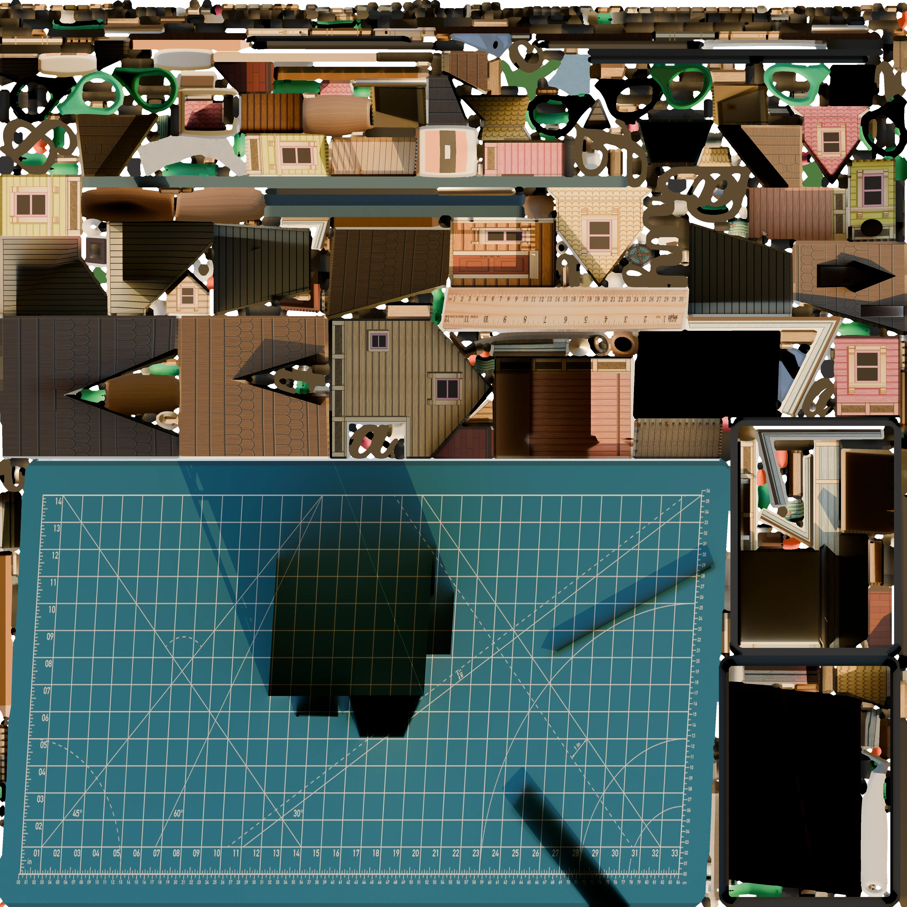

# Atlas Splitter

Atlas Splitter separa atlas de texturas en archivos locales. Un atlas es una imagen que contiene varias piezas, por ejemplo paredes, botones o partes de un modelo. La herramienta crea PNG, máscaras, PSD opcionales, un manifiesto y un reporte HTML para revisarlos.



## Elige el flujo correcto

| Tengo | Debo usar | Resultado |
| --- | --- | --- |
| Sólo un atlas | `split` | Piezas visuales aproximadas |
| Atlas y GLB/glTF | `extract` | Regiones basadas en UV |
| Atlas y deseo nombres | `semantic` | Grupos inferidos |
| Resultado que deseo corregir | `review` | Revisión manual |
| Proyecto para Blender | `blender-addon` | Add-on y scripts de reconstrucción |

`split` usa sólo píxeles. `semantic` añade un modelo local para proponer nombres, pero no convierte una propuesta en un hecho. `extract` lee las coordenadas UV del modelo y no modifica el GLB original. `group-3d` organiza componentes existentes; no crea mallas nuevas.

## Instalación mínima y primer resultado

```text
pipx install atlas-splitter
atlas-splitter doctor
atlas-splitter split atlas.webp --output resultados
```

Abre o regenera el reporte con `atlas-splitter preview resultados/atlas`. Consulta el [inicio rápido](getting-started/quickstart.md) para usar el ejemplo incluido en el repositorio.

## Procesamiento local, plataformas y límites

Las imágenes, modelos, reportes y manifiestos se procesan localmente. Internet sólo se usa al instalar dependencias o cuando una persona solicita descargar un modelo. Python 3.11 a 3.13 funciona en Windows, macOS y Linux; una GPU es opcional.

La separación visual no reconstruye geometría 3D y puede unir piezas que se tocan, perder detalles pequeños o fallar con fondos sin transparencia. Revisa siempre el resultado antes de usarlo en producción.

Sigue con [Instalación](getting-started/installation.md), [Windows portable](getting-started/windows-portable.md) o la [guía de Blender](guides/blender.md).
